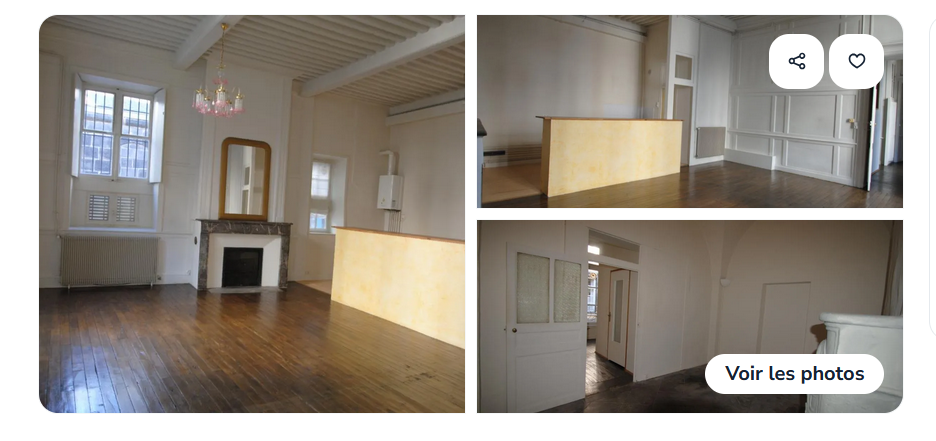
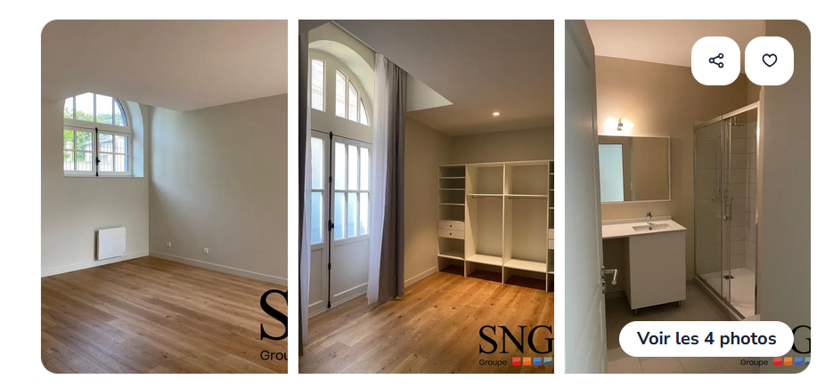
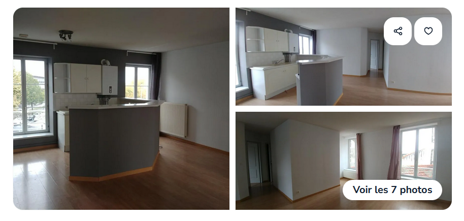
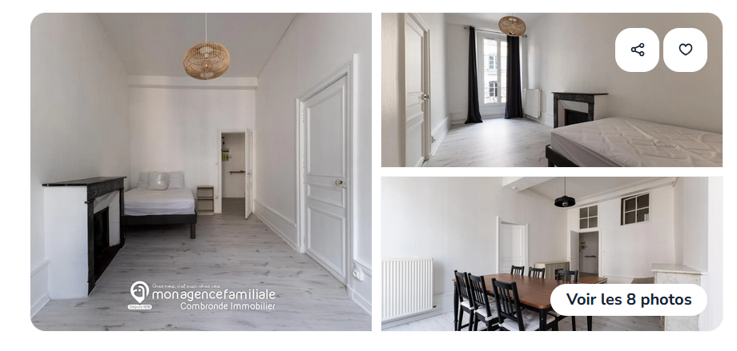
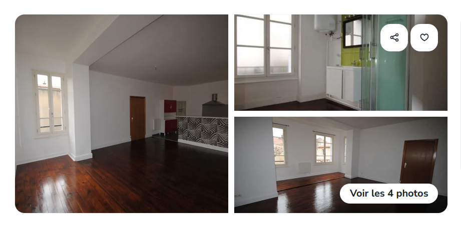

# Recherche appartement

## Appartement 2 pièces 80m2 Riom

**MA NOTE** : 6/10

Voir : [annonce](https://www.leboncoin.fr/ad/locations/2801082151)

Prix : 500$ charges comprises

Surface : 80m2

Agence : Combronde Immobilier

Avantages : 

- Le salon est beau
- Apparemment on est pas au rez de chaussé
- Pas cher

Désaventages :

- Pas de photo de la cuisine
- La chambre à l'air glauque
- non meublé

## Appartement 2 pièces 56m2 Riom

> Déjà loué ! Rappeler vendredi 16 en fin de journée au cas où. 

**MA NOTE** : 9/10

Voir : [annonce](https://www.leboncoin.fr/ad/locations/2799089562)

Prix : 680$ charges comprises (340 chacun)

Surface : 56m2

Agence : SNG

**Contact** : Mme Christelle TISSIDRE 06 78 39 12 90 

Avantages :

- Il est très beau et semble neuf
- La disposition des pièces est chouette
- L'agence à l'air professionnelle (même si ça veut rien dire). En tout cas le carré Vercingétorix de Riom (la résidence) à l'air bien.

Désavantages :

- La consommation d'énergie n'est pas communiquée
- Non meublé

## Appartement 3 pièces 66m2

**MA NOTE** 8,5/10

Voir : [annonce](https://www.leboncoin.fr/ad/locations/2785665382)

Prix : 542$ charges comprises

Surface : 66m2

Agence : Mon toit en Auvergne

Avantages :

- La disposition a l'air chouette, la cuisine est belle
- Il y a 2 chambres (une pas ouf mais qui peut nous servir à jouer ou ranger des choses)
- Chauffage gaz et classe énergétique pas trop mal
- parking gratuit au pied de l'immeuble

## Appartement 2 pièces 58m2

**MA NOTE** : 8/10

Voir : [annonce](https://www.leboncoin.fr/ad/locations/2809677447)

Prix : 650$ charges comprises

Surface : 58m2

Agence : Combronde Immobilier

Avantages :

- Très lumineux
- Style très beau, avec les cheminées, les fenêtres en hauteur.
- 2ème étage

Désaventages :

- Pas d'ascenseur
- Classe énérgétique un peu basse (entre 1000 et 1500 de dépense annuelle soit 104$ par mois)

## Appartement 2 pièces 59m2

**MA NOTE** : 7,5/10

Voir : [annonce](https://www.leboncoin.fr/ad/locations/2807611081)

Prix : 555$ charges comprises

Surface : 59m2

Agence : Combronde Immobilier

Avantages :

- Le parquet est beau
- La sorte de renfoncement sur la photo 3 est très chouette
- Pas trop cher
- Meublé
- 1er étage

Désaventages :

- un peu sombre
- pas d'info sur la classe énergétique

## Meublé centre ville Chatel-Guyon **particulier**

Voir : [annonce](https://www.leboncoin.fr/ad/locations/2479444855)

Prix : 560€

Contact : 06 87 54 50 70 (Justine)

Avantages : 

- Accepte les étudiants

Désavantages :

- meublé
- un peu petit

## Autres :

[Appartement](https://www.leboncoin.fr/ad/locations/2795037724) 5 pièces à 535$ à Riom mais entre 2000 et 2800$ de dépense standard en énergie (208$ par mois) (classe F). (Agence : Mon toit en Auvergne).